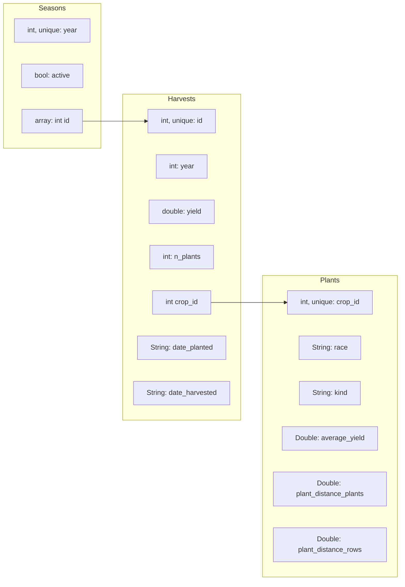

# Database structure

Besides the items listed, some additional information is to be stored in the database:

* weather
  * T high per day/week
  * T low per day/week
  * amount of rain
  * amount of sunlight
* fertilizing
* talcum

